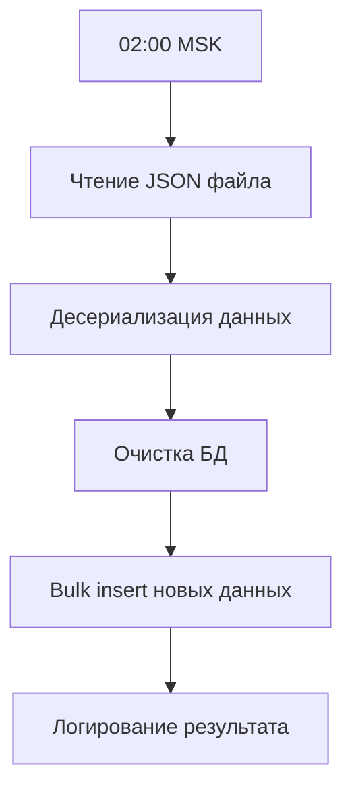

## 1. Обзор продукта

Справочник терминалов - это фоновая служба для автоматического обновления данных о терминалах компании. Продукт решает задачу синхронизации справочника терминалов из JSON файла в базу данных PostgreSQL.

Целевая аудитория - технические специалисты компании, ответственные за актуальность данных о терминалах. Продукт обеспечивает ежедневное автоматическое обновление информации без участия оператора.

## 2. Основные функции

### 2.1 Модули системы

Система состоит из следующих основных модулей:

1. **Фоновая служба (BackgroundService)** - периодическое выполнение импорта данных
2. **Модуль чтения JSON** - загрузка и десериализация данных из файла
3. **Модуль работы с БД** - очистка и bulk insert данных в PostgreSQL
4. **Модуль логирования** - структурированное логирование всех операций

### 2.2 Детали функциональности

| Модуль           | Компонент       | Описание функции                                      |
| ---------------- | --------------- | ----------------------------------------------------- |
| Фоновая служба   | CronJob планировщик | Запускать импорт через CronJob выражение (ежедневно в 02:00 MSK по умолчанию, настраивается) |
| Чтение JSON      | Загрузчик файла | Читать файл \~/files/terminals.json из корневой папки |
| Чтение JSON      | Десериализатор  | Преобразовывать JSON в объекты C# с case-insensitive  |
| Работа с БД      | Очистка данных  | Удалять все существующие записи перед импортом        |
| Работа с БД      | Импорт данных   | Выполнять bulk insert новых терминалов                |
| Логирование      | Логгер          | Выводить структурированные логи в консоль             |
| Обработка ошибок | Обработчик      | Перехватывать и логировать ошибки без краха сервиса   |

## 3. Основной процесс

Процесс импорта данных выполняется следующим образом:

1. Фоновая служба запускается по расписанию через CronJob выражение (по умолчанию: ежедневно в 02:00 MSK)
2. Считывается файл terminals.json из папки files
3. Данные десериализуются в коллекцию объектов Office
4. Выполняется очистка существующих данных в таблице offices
5. Выполняется bulk insert новых данных
6. Все операции логируются с указанием количества обработанных записей



## 4. Дизайн и технические характеристики

### 4.1 Технический стек

* **Язык**: C# 13 (.NET 9)

* **Платформа**: ASP.NET Core 9 (CronJob планировщик задач)

* **ORM**: Entity Framework Core 9

* **База данных**: PostgreSQL

* **Логирование**: ILogger (структурированные логи)

* **DI**: Microsoft.Extensions.DependencyInjection

### 4.2 Структура данных

Основные сущности системы:

* **Office** - терминал с геолокацией и адресом

* **Phone** - телефонные номера терминала

* **Coordinates** - координаты местоположения

* **OfficeType** - тип терминала (PVZ, POSTAMAT, WAREHOUSE)

### 4.3 Производительность

* Время импорта данных: < 5 минут

* Периодичность обновления: ежедневно

* Обработка ошибок без остановки службы

* Graceful shutdown при остановке сервиса

## 5. Критерии приемки

### 5.1 Функциональные критерии

* ✓ BackgroundService реализован через CronJob с настраиваемым расписанием

* ✓ Данные корректно импортируются из JSON в PostgreSQL

* ✓ В консоли отображаются структурированные логи

* ✓ Таблица offices содержит актуальные данные после импорта

### 5.2 Нефункциональные критерии

* ✓ Время импорта не превышает 5 минут

* ✓ Сервис корректно обрабатывает ошибки без краха

* ✓ Реализован graceful shutdown при остановке

* ✓ В системе созданы необходимые индексы в БД

### 5.3 Примеры ожидаемых логов

```
{Time} INFO: Загружено {Count} терминалов из JSON
{Time} INFO: Удалено {OldCount} старых записей
{Time} INFO: Сохранено {NewCount} новых терминалов
{Time} ERROR: Ошибка импорта: {Exception}
```

